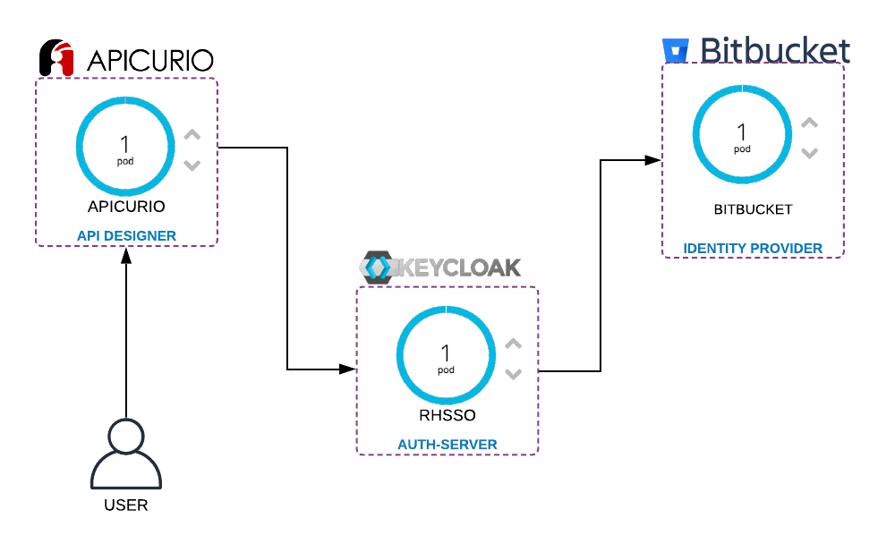
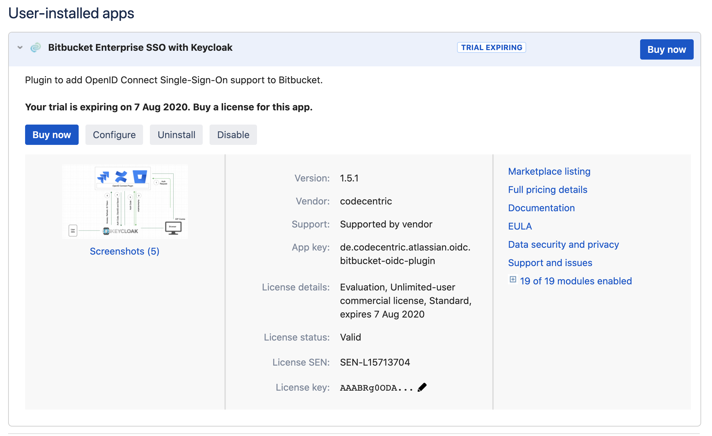

= Apicurio - Red Hat Single Sign On - Bitbucket

https://sso-telecom.apps.cluster-latam-2fcf.latam-2fcf.example.opentlc.com[RHSSO]
http://bitbucket-telecom.apps.cluster-latam-2fcf.latam-2fcf.example.opentlc.com[BITBUCKET]
https://apicurio-studio.apps.cluster-latam-2fcf.latam-2fcf.example.opentlc.com[APICURIO]

== Bitbucket 

http://bitbucket-telecom.apps.cluster-latam-2fcf.latam-2fcf.example.opentlc.com[Admin Console]

Not only Bitbucket but also the additional plugins requires license, you can enable trial by the atlassian portal. 

Install Bitbucket directly using the image `docker.io/atlassian/bitbucket-server/`

Create a PVC and set to the container, so your configurations can survive to restarts. 

    oc set volume deployment/bitbucket --add --name=bitbucket-1 --type=persistentVolumeClaim --claim-name=bitbucket --mount-path=/var/atlassian/application-data/bitbucket

=== Credentials 

Local
nopagados
    username: rramalho
    password: redhat

=== Plugins

(DEPRECATED) Using Orange plugin instead.

. Bitbucket Enterprise SSO with Keycloak 

== Install the RHSSO 7.3 from the official templates

https://sso-telecom.apps.cluster-latam-2fcf.latam-2fcf.example.opentlc.com/[Admin Console]
https://sso-telecom.apps.cluster-latam-2fcf.latam-2fcf.example.opentlc.com/auth/realms/redhat/.well-known/openid-configuration

RHSSO useful informations 

    "issuer": "https://sso-telecom.apps.cluster-latam-2fcf.latam-2fcf.example.opentlc.com/auth/realms/redhat",
    "authorization_endpoint": "https://sso-telecom.apps.cluster-latam-2fcf.latam-2fcf.example.opentlc.com/auth/realms/redhat/protocol/openid-connect/auth",
    "token_endpoint": "https://sso-telecom.apps.cluster-latam-2fcf.latam-2fcf.example.opentlc.com/auth/realms/redhat/protocol/openid-connect/token",
    "token_introspection_endpoint": "https://sso-telecom.apps.cluster-latam-2fcf.latam-2fcf.example.opentlc.com/auth/realms/redhat/protocol/openid-connect/token/introspect",
    "userinfo_endpoint": "https://sso-telecom.apps.cluster-latam-2fcf.latam-2fcf.example.opentlc.com/auth/realms/redhat/protocol/openid-connect/userinfo",
    "end_session_endpoint": "https://sso-telecom.apps.cluster-latam-2fcf.latam-2fcf.example.opentlc.com/auth/realms/redhat/protocol/openid-connect/logout",
    "jwks_uri": "https://sso-telecom.apps.cluster-latam-2fcf.latam-2fcf.example.opentlc.com/auth/realms/redhat/protocol/openid-connect/certs",
    "check_session_iframe": "https://sso-telecom.apps.cluster-latam-2fcf.latam-2fcf.example.opentlc.com/auth/realms/redhat/protocol/openid-connect/login-status-iframe.html",

== Apicurio 

. First install the PostgreSQL 

    oc new-app  --template=postgresql-persistent \
                --param=POSTGRESQL_PASSWORD=redhat \
                --param=POSTGRESQL_USER=redhat \
                --param=POSTGRESQL_DATABASE=apicuriodb

. Install Apicurio studio

    oc new-app  --template=apicurio-studio \
                --param=UI_ROUTE=apicurio-studio.apps.cluster-bd27.bd27.example.opentlc.com \
                --param=API_ROUTE=apicurio-studio-api.apps.cluster-bd27.bd27.example.opentlc.com \
                --param=WS_ROUTE=apicurio-studio-ws.apps.cluster-bd27.bd27.example.opentlc.com \
                --param=AUTH_ROUTE=sso-bitbucket.apps.cluster-bd27.bd27.example.opentlc.com \
                --param=DB_USER=redhat \
                --param=DB_PASS=redhat \
                --param=DB_NAME=apicuriodb \
                --param=KC_REALM=apicurio \
                --param=KC_USER=admin \
                --param=KC_PASS=password 

. After istall the Apicurio template `apicurio-template.yml`

Remember to point to the Postgres and RHSSO already Installed. 

== Environment Access 

http://console-openshift-console.apps.cluster-latam-6b8a.latam-6b8a.example.opentlc.com[Openshift]

All resources is on the project `apicurio`.

amqp://messaging-b830662.redhat-rhmi-amq-online.svc:5672